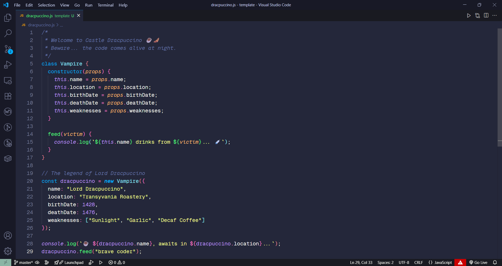

# Dracpuccino

[](#)
[](LICENSE)

---

## 🖌️ Overview

**Dracpuccino** is a custom Visual Studio Code theme that combines the best of two worlds:

- 🎨 **Syntax token colors** are fully based on the popular [Dracula](https://draculatheme.com/) theme, ensuring excellent readability and vibrant code highlighting.
- 🌌 **Dark user interface elements** (sidebar, status bar, panels) are inspired by the soft and cozy palette of [Catppuccin](https://catppuccin.com/), providing a comfortable and modern environment for long coding sessions.
- ✨ **Customized colors** have been added to create a unique, personalized look that enhances visual harmony and user experience.

 ---
 
## 📸 Screenshots

> Here’s **Dracpuccino Theme** in action:



---

## 📦 Installation

### Local Testing

```bash
git clone https://github.com/leonardobe/vscode-theme-dracpuccino.git

cd vscode-theme-dracpuccino
```
>  Optional: Build VSIX package (requires vsce)

```bash
vsce package
```

Then install the generated `.vsix` file in VSCode:

1. Open VSCode Extensions panel (`Ctrl+Shift+X` or `Cmd+Shift+X`).
2. Click on the ellipsis menu (`...`) at the top.
3. Select **Install from VSIX...**.
4. Choose the `.vsix` file generated above.

---

## 🎨 Usage

After installation:

1. Open the Command Palette (`Ctrl+Shift+P` / `Cmd+Shift+P`).
2. Search for and select **Preferences: Color Theme**.
3. Choose **dracpuccino** from the list.

---

## 📄 License

This project is licensed under the [MIT License](LICENSE).

---

## 📬 Contact

Developed by [Leonardo Curtis](https://github.com/leonardobe/)  

💡 For questions, feedback or feature requests, please open an issue or reach out via GitHub.
